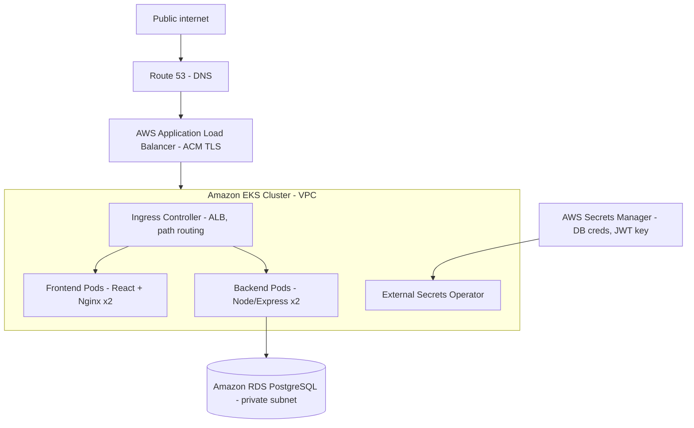

# PulseBoard

PulseBoard is a full-stack, real-time metrics and application monitoring dashboard. It provides developers and system administrators with a centralized, responsive interface to track application performance, manage system health, and visualize real-time data flow.

Built with a containerized microservices architecture, PulseBoard is designed to be cloud-native, highly available, and scalable from day one.

---

## System Architecture

- **Frontend:** React / Next.js / Tailwind CSS (client-side UI)
- **Backend:** Node.js / Express API
- **Database:** PostgreSQL (Amazon RDS), managed via Prisma ORM
- **Infrastructure:** Amazon EKS (Kubernetes), Amazon ECR, AWS Route 53, Ingress Controllers
- **Secrets Management:** External Secrets Operator connecting directly to AWS Secrets Manager

### Architecture Diagram



## Tech Stack

- **Languages:** JavaScript, TypeScript, Golang (if applicable)
- **Frameworks:** React, Next.js, Express, Tailwind CSS
- **DevOps:** Docker, Kubernetes (`kubectl`), AWS EKS, ECR, IAM, Route 53
- **Database & ORM:** PostgreSQL, Prisma

---

## How to Build and Deploy Your Own Instance

This guide walks you through replicating the exact AWS/Kubernetes production environment used for PulseBoard.

### 1. Provision the Infrastructure

You will need an AWS account. We recommend using `eksctl` for the Kubernetes cluster and the AWS Console for the database.

- **EKS Cluster:** Create a cluster (e.g., `pulseboard-cluster`) with managed node groups.
- **Database:** Spin up an Amazon RDS PostgreSQL instance in the same VPC as your EKS cluster. Ensure the security group allows inbound traffic on port `5432` from your EKS worker nodes.
- **IAM Permissions:** Ensure your EKS Node Group IAM Role has the `AmazonEC2ContainerRegistryReadOnly` policy attached, or your pods will fail to pull images with `ImagePullBackOff`.

### 2. Prepare the Container Registry (ECR)

Create two private repositories in Amazon ECR (e.g., `pulseboard-frontend` and `pulseboard-backend`).

Authenticate your local Docker client to AWS ECR:

```bash
aws ecr get-login-password --region <YOUR_REGION> | docker login --username AWS --password-stdin <YOUR_ACCOUNT_ID>.dkr.ecr.<YOUR_REGION>.amazonaws.com
```

### 3. Build and Push Docker Images

From your project root, build the images for both frontend and backend.

**Backend:**

```bash
cd backend
docker build -t pulseboard-backend:latest .
docker tag pulseboard-backend:latest <YOUR_ACCOUNT_ID>.dkr.ecr.<YOUR_REGION>.amazonaws.com/pulseboard-backend:latest
docker push <YOUR_ACCOUNT_ID>.dkr.ecr.<YOUR_REGION>.amazonaws.com/pulseboard-backend:latest
```

_(Repeat the process for the `frontend` folder.)_

### 4. Configure Kubernetes Secrets

Do not hardcode database credentials. PulseBoard uses AWS Secrets Manager and the External Secrets Operator:

1. Store your `DATABASE_URL` in AWS Secrets Manager.
2. Install the External Secrets Operator on your EKS cluster.
3. Create a `SecretStore` and `ExternalSecret` manifest to sync the AWS secret into a native Kubernetes secret (e.g., `backend-secret`).

### 5. Deploy to Kubernetes

Create your Kubernetes manifests (`frontend-k8s.yaml` and `backend-k8s.yaml`). Ensure your backend deployment references the exact ECR image path and tags.

Apply the configurations:

```bash
kubectl apply -f k8s/backend-k8s.yaml
kubectl apply -f k8s/frontend-k8s.yaml
```

> **Common Pitfall (Readiness Probes):** If your pods stay at `0/1 Running` but the application logs show success, check your `readinessProbe`. Ensure the path (e.g., `/health`) matches an actual route in your Express server. If you don't have a health route, temporarily remove the `readinessProbe` block from your YAML.

### 6. Set Up Networking and DNS

1. Deploy an AWS Load Balancer Controller to your cluster.
2. Apply an `Ingress` resource to expose your frontend and backend services to the internet via an Application Load Balancer (ALB).
3. Copy the ALB's DNS name and create an `A Record` (Alias) in Route 53 pointing your custom domain to the Load Balancer.

### 7. Verify the Stack

Check that all pods are running and test your live domain:

```bash
kubectl get pods
curl -I https://yourdomain.com
```
